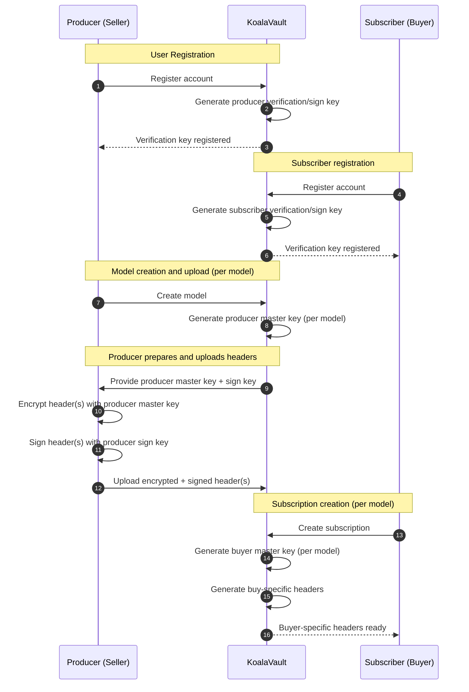
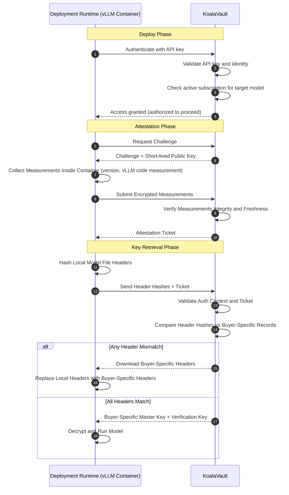

<Warning>
This document describes KoalaVault’s security architecture and a reference implementation intended for evaluation and testing. KoalaVault is not a production security guarantee. Do not rely on KoalaVault as your sole protection mechanism in high‑risk or regulated environments.
</Warning>

## Layer 1: Secure File Format for Proprietary Models

At its foundation, KoalaVault relies on **CryptoTensors**, a secure extension of the open-source Safetensors format designed for encrypted model storage and controlled access.  

Instead of storing raw tensor data directly, CryptoTensors wraps each tensor in a cryptographic envelope—its bytes are encrypted and access is governed by embedded policy metadata.  

This approach preserves the performance and compatibility of Safetensors while ensuring that proprietary model weights remain confidential and verifiable throughout their lifecycle.

- **Header/body separation:** The header stays plaintext, containing tensor names, shapes, and dtypes for compatibility, while the tensor payloads are encrypted.
- **Per-tensor encryption:** Each encrypted tensor uses a unique Data Encryption Key (DEK) and initialization vector (IV), typically under AES-GCM; every DEK is wrapped by a model-specific master key.
- **Integrity and compatibility:** A digital signature protects the header; AEAD ensures ciphertext integrity; the mmap-friendly layout preserves seamless loading with Safetensors tooling.
- **Distribution-ready design:** Encrypted models can be safely shared or published, while master keys are released only to verified runtimes through the KoalaVault Server.

By integrating CryptoTensors at this layer, KoalaVault ensures that every model is both **securely locked** and **natively interoperable**—confidential by default, yet fully usable within existing LLM inference workflows.

For more details on CryptoTensors format, see our [CryptoTensors](/security/cryptotensors) documentation.

## Layer 2: User-Isolated Key Management

While CryptoTensors protects the model file itself through encryption, Layer 2 defines **who** can decrypt **which** model by introducing user-isolated key domains.  

KoalaVault separates producers (model creators) and subscribers (authorized users) at the cryptographic level so that no key, signature, or header can be reused across roles or tenants. This separation can reduce the risk of key leakage, and limit the impact of a key compromise to a single user or model.

- **Key Scoping:** The producer and subscriber master keys are distinct. Each key is scoped per model, that is producer holds one master key per model, and subscriber receives a unique per-model key created by the KoalaVault Server at subscription time.

- **Subscriber Key Provisioning:** Upon subscription creation, the KoalaVault Server generates a subscriber-specific master key scoped to that model, and immediately creates/updates the personalized headers for that subscriber, which is derived from the producer headers and the subscriber key.

Together, Layer 2’s per-user, per-model isolation ensures that only the rightful subscriber can proceed to Layer 3 to attest, retrieve keys, and run the model.

## Layer 3: Deployment Authentication & Authorization

Building on Layer 2’s per-user, per-model isolation, Layer 3 verifies the runtime and the model state before any key release: the deployment runtime (i.e., the enhanced vLLM container) must attest its environment, prove file integrity, and only then receive the minimal key material to decrypt and run. The process has three compact stages:

1. **Attestation challenge and measurements:** the deployment runtime requests a fresh challenge, then submits encrypted measurements from the secure runtime (including the challenge). If valid, the server issues a short‑lived ticket bound to the user and model (and, for subscribers, to the subscription).

<Note>
The KoalaVault client only read and scan the filesystem of the container, and does not access the host filesystem.
</Note>

2. **File header integrity check:** the deployment runtime computes hashes of local model file headers and sends them with the ticket. The server validates the user context, ticket authenticity/freshness, presence of required keys, and compares per‑file header hashes against personalized records.

3. **Decision and next step:** if all headers match, the server responds with the buyer-specific master key and verification key. If any header does not match, the server responds with the headers that need synchronization; the deployment runtime updates them and repeats the integrity check.

Together, these checks ensure that keys are released only to an authenticated subscriber running the expected software against the correct, buyer-specific headers—after which ongoing safeguards are handled by Layer 4.

## Layer 4: Runtime Integrity Protection

Even with encryption and policy enforcement in place, the security of a deployed model ultimately depends on the integrity of its runtime environment.  
Layer 4 strengthens this final boundary by ensuring that the execution context itself is verifiable, read-only, and sealed against tampering.  
It combines container-level hardening with in-container integrity guards so that decryption keys are usable **only** inside a trusted, attested runtime whose state matches the expected configuration.

- **Container Hardening**
  - The container runs with a **read-only root filesystem**, preventing writes to image layers and blocking modification of binaries or configuration files.  
  - **Linux capabilities** are aggressively minimized to reduce kernel-level attack surface.  
  - Writable areas are strictly controlled using ephemeral **tmpfs mounts** to provide scratch space without persisting data to disk.  
  - **Mounts are constrained** to the model directory, ensuring the loader can only read files under `/models` inside the container.  
  - The runtime explicitly forbids privileged mode, host filesystem access, or arbitrary device mounts beyond what is required for inference (for example, GPUs).

- **In-Container Runtime Guard**
  - The guard verifies that root filesystem layers are mounted read-only by inspecting `/proc/self/mountinfo`; any unexpected `rw` mount triggers a fail-closed response.  
  - It enforces a strict **mount whitelist**, allowing only `/models` binds and `/tmp` tmpfs; additional mounts, especially those with execute or host access, are denied.  
  - **Writable-path probes** periodically test protected directories such as `/usr` and image layer paths to confirm that write attempts are blocked.  
  - The guard audits process **capabilities and tracing settings**, rejecting unexpected privileges, `ptrace` or eBPF attachment, or namespace escapes that could alter memory or code.  
  - It detects and blocks **dynamic code injection** by checking `LD_PRELOAD`, `LD_LIBRARY_PATH`, and inspecting `/proc/self/maps` for unapproved shared objects under writable mounts.

Once activated, this protection layer enforces strict operational guarantees: decryption keys function only within a verified, read-only container whose mounts and measurements match the attested baseline. Any attempt to modify binaries, alter vLLM loader code, or elevate privileges immediately invalidates key access and terminates the session. Decrypted tensors reside solely in process memory, and all attempts to persist plaintext to disk or external mounts are blocked by the read-only filesystem and guard checks. Every security decision and denial is logged to provide auditable proof of runtime integrity.

In essence, Layer 4 ensures that even after keys are securely released, the runtime remains a **sealed execution capsule**—immutable, verifiable, and self-protecting. Any deviation from the attested configuration results in instant revocation of decryption privileges, completing KoalaVault’s end-to-end security chain from encrypted storage to verified execution.

For more details on deployment setup, see our [Docker Run Guide](/deploy/docker-run-guide).

---
## Summary

KoalaVault’s layered design provides a continuum of protection—from encrypted storage formats to runtime enforcement.  
Each layer builds on the previous one to ensure that model confidentiality, integrity, and authenticity persist across the entire lifecycle of deployment and use.