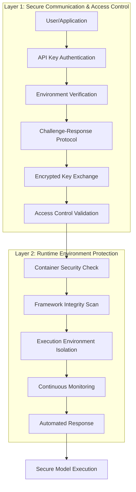
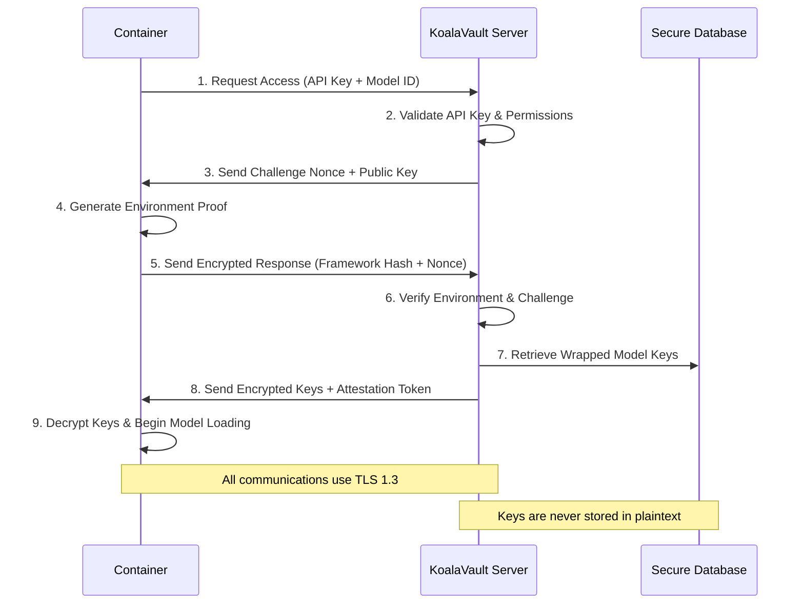
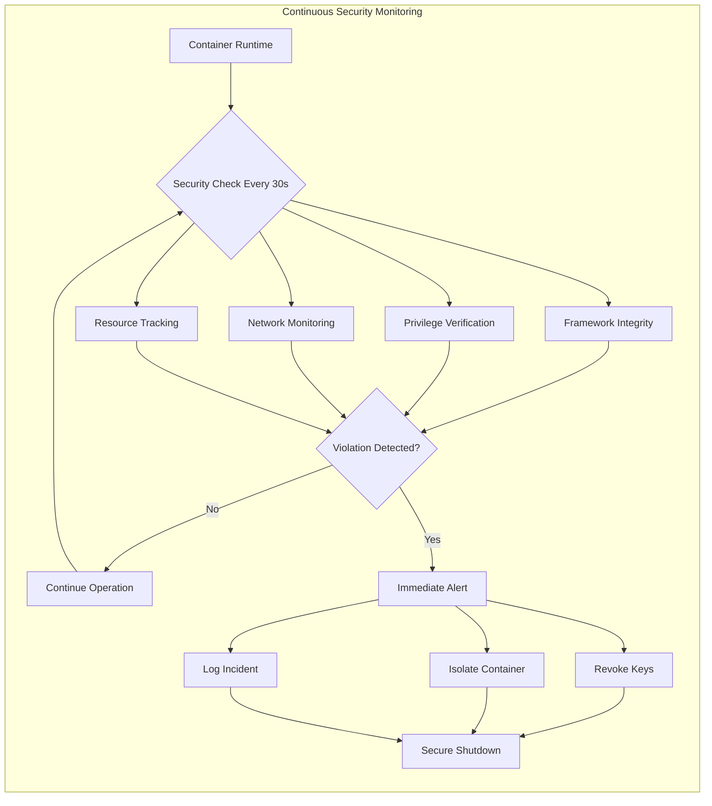

<Note>
KoalaVault implements a defense-in-depth security architecture with zero-trust principles. The system provides cryptographic protection for AI models through multi-layer authentication, runtime environment verification, and continuous security monitoring.
</Note>

# Security Architecture

KoalaVault's security architecture consists of two primary security layers that work together to protect encrypted AI models during deployment and runtime execution.

## Architecture Overview

The security system operates on zero-trust principles where every component, request, and environment must be explicitly verified before gaining access to encrypted model data.

## Layer 1: Secure Communication and Access Control

This layer handles authentication, authorization, and secure key distribution between clients and the KoalaVault server.

### Authentication System

**API Key Management**
- Each user receives a unique API key in the format `sk-{random_string}`
- Keys are cryptographically generated with 256 bits of entropy
- Server validates API keys against user permissions and subscription status
- Failed authentication attempts are rate-limited and logged

**JWT Token System**
- Server issues JSON Web Tokens after successful API key authentication
- Tokens contain user ID, subscription information, and expiration timestamps
- Separate token types for different access scopes (user, admin, attestation)
- Tokens expire automatically to limit exposure window

### Key Exchange Protocol

The server distributes decryption keys through a secure challenge-response protocol that prevents replay attacks and ensures keys are only delivered to verified environments.

**Protocol Steps:**
1. **Access Request**: Client sends API key and model identifier
2. **Authentication**: Server validates credentials and subscription status
3. **Challenge Generation**: Server creates cryptographic challenge with RSA key pair
4. **Environment Measurement**: Client computes hash of runtime environment
5. **Response Submission**: Client encrypts environment proof with server's public key
6. **Verification**: Server validates environment against approved baselines
7. **Key Delivery**: Server provides wrapped encryption keys if verification passes
8. **Decryption**: Client unwraps keys and begins secure model loading

### Access Control Framework

**Subscription Verification**
- Each model access requires valid subscription for the specific model
- Server checks subscription status, usage quotas, and access permissions
- Geographic and temporal restrictions can be enforced per subscription
- Usage tracking enables billing and compliance reporting

**Key Wrapping Architecture**
- Model encryption keys are wrapped with server storage keys
- Multiple encryption layers protect keys during storage and transit
- Key derivation uses HKDF with model-specific context information
- Automatic key rotation supported without model re-encryption

## Layer 2: Runtime Environment Protection

This layer ensures the execution environment remains secure throughout the model lifecycle.

### Container Security Verification

**Privilege Validation**
- Verifies containers run with minimal required Linux capabilities
- Checks for dangerous capabilities that could compromise security
- Monitors filesystem permissions and mount configurations
- Ensures containers cannot escalate privileges during execution

**Filesystem Protection**
- Validates that system paths are mounted read-only
- Checks that writable paths use memory-only filesystems (tmpfs)
- Verifies no unauthorized writable mounts exist
- Performs periodic write-protection tests on critical paths

### Framework Integrity Assurance

**Code Fingerprinting**
- Computes SHA-256 hashes of all files in the AI framework
- Creates deterministic measurement of the entire software stack
- Compares runtime environment against known-good baselines
- Detects unauthorized modifications to framework code

**Supply Chain Verification**
- Validates framework packages match official releases
- Checks cryptographic signatures on framework binaries
- Monitors for unauthorized Python modules or native libraries
- Prevents execution if untrusted code is detected

### Runtime Security Monitoring

The system continuously monitors the execution environment for security violations.

**Monitoring Components:**
- **Container State**: Linux capabilities, cgroups, and namespace configuration
- **Framework Integrity**: File modification detection and hash verification
- **Network Activity**: Unexpected network connections or data exfiltration
- **Resource Usage**: Memory, CPU, and disk usage patterns

**Response Actions:**
- **Key Revocation**: Immediate invalidation of all decryption keys
- **Container Isolation**: Network and filesystem access restrictions
- **Audit Logging**: Detailed forensic information for security analysis
- **Graceful Shutdown**: Secure termination of model execution

## Security Properties

### Cryptographic Guarantees

**Encryption Standards**
- AES-256-GCM for symmetric encryption of model weights
- RSA-4096 for asymmetric key exchange during challenge-response
- Ed25519 for digital signatures on file headers
- HKDF-SHA256 for key derivation and management

**Key Management**
- Keys exist only in memory, never persisted to disk
- Automatic key clearing on process termination
- Secure random number generation for all cryptographic operations
- Forward secrecy through ephemeral key exchange

### Security Boundaries

**Trust Assumptions**
- KoalaVault server infrastructure is trusted
- TLS certificate infrastructure is trusted
- Client execution environment can be compromised
- Model files can be copied but remain encrypted

**Attack Resistance**
- Model weights cannot be extracted without valid keys
- Keys cannot be obtained without verified environment
- Environment cannot be spoofed due to cryptographic measurement
- Network communications protected against eavesdropping and tampering

## Deployment Security

### Container Configuration

**Required Security Flags**
- `--read-only`: Filesystem mounted read-only except specified paths
- `--cap-drop ALL`: Remove all Linux capabilities by default
- `--cap-add DAC_OVERRIDE`: Required for GPU device access
- `--tmpfs /tmp`: Memory-only filesystem for temporary data

**Mount Security**
- Host directories mounted read-only contain only encrypted data
- Writable mounts use tmpfs to prevent data persistence
- No privileged mounts or device access beyond GPU
- Container cannot modify host filesystem

### Network Security

**Communication Channels**
- All API communications use TLS 1.3 with certificate pinning
- Perfect forward secrecy for all key exchange operations
- No plaintext transmission of sensitive data
- Network isolation prevents unauthorized data exfiltration

## Monitoring and Alerting

### Security Events

**Critical Violations** (immediate response):
- Trust-remote-code detection in AI framework
- Unauthorized privilege escalation attempts
- Filesystem write attempts to protected paths
- Framework integrity verification failures

**Warning Events** (logged for analysis):
- Authentication retry attempts
- Network connectivity issues during key exchange
- Container resource usage anomalies
- Subscription quota approaching limits

### Audit Capabilities

**Logging Requirements**
- All authentication attempts with timestamps and IP addresses
- Complete key exchange and access control decisions
- Security violations with detailed context information
- Model access patterns for usage analysis

**Compliance Support**
- Comprehensive audit trails for regulatory requirements
- Role-based access control integration
- Data retention policies for security logs
- Automated compliance reporting capabilities

## Limitations and Considerations

### Current Scope

**Protected Assets**
- Model weights and parameters stored in safetensors format
- Metadata and configuration information
- Access patterns and usage analytics

**Security Boundaries**
- Protection limited to model files, not training data
- Runtime security depends on container isolation
- Network security relies on TLS certificate infrastructure
- Hardware security modules not currently integrated

### Future Enhancements

**Hardware Security**
- Integration with TPM and HSM for key storage
- Support for Intel SGX and ARM TrustZone
- Hardware-based attestation capabilities

**Advanced Cryptography**
- Post-quantum cryptographic algorithms
- Homomorphic encryption for inference
- Zero-knowledge proofs for access control

## Integration Guidelines

### API Integration

**Authentication Flow**
1. Obtain API key from KoalaVault dashboard
2. Configure environment variables for model access
3. Ensure container security flags are properly set
4. Verify framework integrity before model loading

**Error Handling**
- Authentication failures return generic error messages
- Network issues should trigger automatic retry with exponential backoff
- Security violations require manual intervention
- Key corruption triggers automatic re-fetch from server

### Operational Procedures

**Security Best Practices**
- Regular rotation of API keys and access tokens
- Monitoring of security logs for anomalous activity
- Periodic review of access control policies
- Testing of incident response procedures

This security architecture provides comprehensive protection for AI models while maintaining operational flexibility and performance requirements.