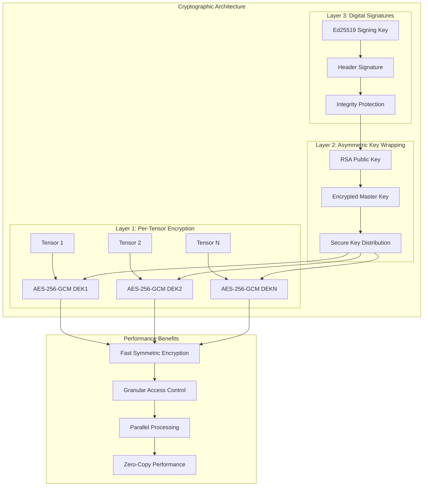
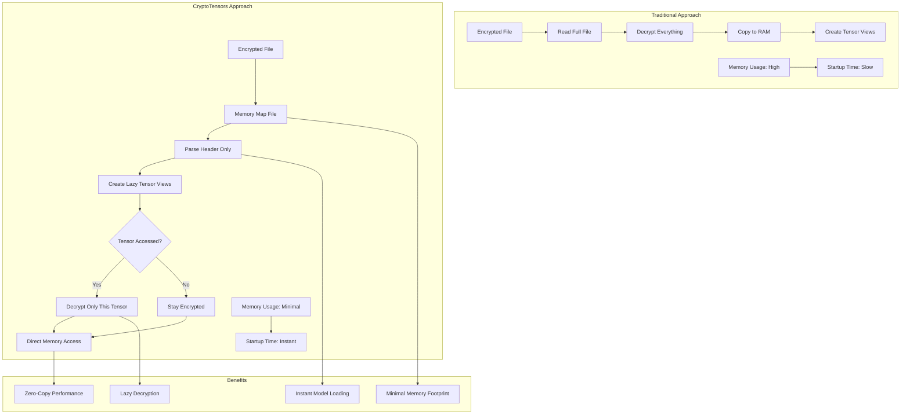
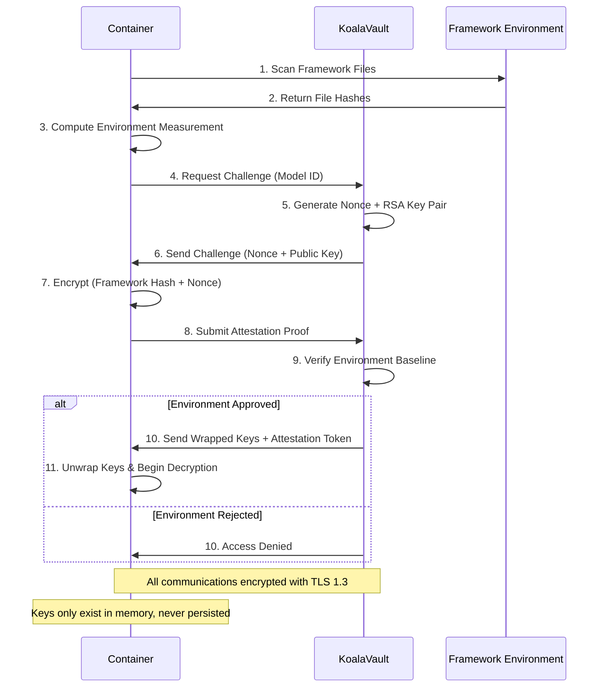

<Note>
CryptoTensors extends the safetensors format with encryption, digital signatures, and key management capabilities. The format maintains compatibility with existing safetensors tools while providing cryptographic protection for AI model weights through per-tensor encryption and lazy decryption.
</Note>

# CryptoTensors Technical Specification

CryptoTensors is an encrypted extension of the safetensors format that provides cryptographic protection for AI model weights while maintaining the performance characteristics that make safetensors effective for large model deployment.

## Format Overview

CryptoTensors maintains the basic safetensors structure while adding cryptographic metadata for encryption, signing, and key management:

```
[8 bytes: header length][header JSON][encrypted tensor data]
```

### File Format Compatibility

- **Backward Compatible**: Standard safetensors parsers can read the basic structure
- **Forward Compatible**: Version-aware metadata supports future enhancements
- **Zero-Copy Preservation**: Memory mapping and lazy loading maintained
- **Framework Agnostic**: Works with PyTorch, TensorFlow, JAX, and other ML frameworks

## Cryptographic Architecture

CryptoTensors implements a three-layer cryptographic system that balances security, performance, and operational requirements.



### Layer 1: Per-Tensor Symmetric Encryption

**Algorithm**: AES-256-GCM (Galois/Counter Mode)
- **Key Size**: 256 bits (32 bytes)
- **IV Size**: 96 bits (12 bytes) - randomly generated per tensor
- **Authentication Tag**: 128 bits (16 bytes)
- **Key Derivation**: HKDF-SHA256 with tensor name as context

**Benefits**:
- Fast encryption/decryption suitable for large tensor data
- Authenticated encryption prevents tampering
- Independent keys enable granular access control
- Parallel processing across multiple tensors

### Layer 2: Asymmetric Key Wrapping

**Algorithm**: RSA-OAEP with SHA-256
- **Key Size**: 2048 or 4096 bits (configurable)
- **Padding**: OAEP with SHA-256 hash and MGF1
- **Key Exchange**: Ephemeral RSA keys for each session

**Purpose**:
- Secure distribution of symmetric keys without pre-shared secrets
- Enables remote key management and access control
- Supports key rotation without re-encrypting model data

### Layer 3: Digital Signatures

**Algorithm**: Ed25519 (Edwards-curve Digital Signature Algorithm)
- **Key Size**: 256 bits (32 bytes)
- **Signature Size**: 512 bits (64 bytes)
- **Hash Function**: SHA-512 (built into Ed25519)

**Protection**:
- Header integrity verification
- Prevents malicious model modifications
- Ensures model provenance and authenticity
- Non-repudiation for model distribution

## Header Structure

The CryptoTensors header extends the standard safetensors JSON format with encryption metadata:

### Standard Safetensors Fields

```json
{
  "tensor_name": {
    "dtype": "F32",
    "shape": [1024, 768],
    "data_offsets": [0, 3145728]
  },
  "__metadata__": {
    "model_name": "example-model",
    "version": "1.0"
  }
}
```

### CryptoTensors Extensions

```json
{
  "__encryption__": {
    "version": "1",
    "algorithm": "aes256gcm",
    "tensors": {
      "tensor_name": {
        "iv": "base64-encoded-iv",
        "tag": "base64-encoded-auth-tag"
      }
    }
  },
  "__crypto_keys__": {
    "version": "1",
    "enc": {
      "kty": "oct",
      "alg": "A256GCM",
      "k": "base64-encoded-wrapped-key"
    },
    "sign": {
      "kty": "OKP",
      "crv": "Ed25519",
      "x": "base64-encoded-public-key"
    }
  },
  "__signature__": "base64-encoded-header-signature",
  "__policy__": {
    "version": "1",
    "remote_keys": true,
    "attestation_required": true
  }
}
```

## Lazy Decryption Implementation

CryptoTensors implements lazy decryption to maintain zero-copy performance characteristics while providing cryptographic protection.

### Memory Mapping Strategy



### Implementation Details

**Initial Loading**:
1. Memory map the encrypted file
2. Parse and verify header signature
3. Extract encryption metadata without decrypting tensor data
4. Create tensor view objects with lazy decryption callbacks

**On-Demand Decryption**:
1. First access to tensor triggers decryption
2. Derive tensor-specific key from master key
3. Decrypt tensor data in-place using memory-mapped buffer
4. Subsequent accesses use decrypted data directly

**Memory Management**:
- Decrypted tensors remain in memory until process termination
- Memory usage grows only with accessed tensors
- Unused tensors remain encrypted and consume minimal memory

## Key Management

CryptoTensors supports multiple key management strategies depending on deployment requirements.

### Embedded Keys (Development/Testing)

Keys are stored directly in the file metadata:

```json
{
  "__crypto_keys__": {
    "enc": {
      "kty": "oct",
      "alg": "A256GCM",
      "k": "base64-encoded-key-data"
    }
  }
}
```

**Use Case**: Development, testing, non-production environments
**Security Level**: Low - keys travel with model files

### Remote Key Management (Production)

Keys are retrieved from KoalaVault servers through secure protocols:



**Use Case**: Production deployments, commercial model distribution
**Security Level**: High - keys never stored with model files

### Framework Attestation

Before providing decryption keys, the system verifies the integrity of the AI framework to prevent unauthorized access through modified software.

**Measurement Process**:
1. **File Discovery**: Scan configured Python package directories
2. **Hash Computation**: Calculate SHA-256 hash of each framework file
3. **Baseline Generation**: Create deterministic measurement of software stack
4. **Server Verification**: Compare measurement against approved baselines

**Protected Paths** (default configuration):
- `/opt/venv/lib/python*/site-packages` (virtual environment)
- `/usr/local/lib/python*/site-packages` (system installation)
- `/usr/lib/python*/dist-packages` (distribution packages)

**Ignored Components**:
- `__pycache__` directories (bytecode cache)
- `.git` and `.svn` directories (version control)
- Log files and temporary data

## Performance Characteristics

### Encryption Overhead

**Symmetric Encryption**: ~1-5% computational overhead for AES-256-GCM
**Memory Usage**: No additional memory for encrypted tensors
**I/O Performance**: Identical to standard safetensors for accessed tensors
**Startup Time**: No impact - only header parsing required

### Lazy Loading Benefits

**Large Model Support**: 70B+ parameter models load instantly
**Memory Efficiency**: Only used tensors consume decrypted memory
**Parallel Access**: Multiple tensors can be decrypted simultaneously
**Cache Friendly**: Frequently accessed tensors remain decrypted

### Scalability Metrics

- **File Size**: ~0.1% overhead for encryption metadata
- **Network Transfer**: Identical to original safetensors files
- **Concurrent Access**: Supports multiple readers per file
- **Key Exchange**: ~100ms additional latency for initial authentication

## Integration Specifications

### API Compatibility

CryptoTensors maintains API compatibility with existing safetensors usage:

```python
# Standard safetensors
import safetensors
tensors = safetensors.load_file("model.safetensors")

# CryptoTensors (identical API)
tensors = safetensors.load_file("model.cryptotensors")
```

### Environment Configuration

**Required Environment Variables**:
- `__KV_INTERNAL_API_KEY__`: KoalaVault API authentication key
- `__KV_INTERNAL_MODEL_OWNER__`: Model owner username
- `__KV_INTERNAL_MODEL_NAME__`: Model identifier
- `__KV_INTERNAL_MODEL_PATH__`: Path to encrypted model files

**Optional Configuration**:
- `KOALAVAULT_BASE_URL`: Override default API endpoint (debug builds only)
- `KOALAVAULT_TIMEOUT`: Network timeout for key exchange operations
- `KOALAVAULT_RETRY_COUNT`: Maximum authentication retry attempts

### Framework Support

**Supported Frameworks**:
- PyTorch: Full support with zero-copy tensor loading
- TensorFlow: Compatible through numpy array conversion
- JAX: Direct integration with jax.numpy arrays
- Transformers: Automatic detection and initialization

**Platform Compatibility**:
- Linux: Full support (x86_64, ARM64)
- macOS: Development support (limited container features)
- Windows: Basic support (no container security)

## Security Properties

### Threat Model

**Protected Against**:
- Unauthorized access to model weights without valid keys
- Model tampering and integrity violations
- Man-in-the-middle attacks during key exchange
- Framework modification attacks

**Trust Assumptions**:
- KoalaVault server infrastructure is trusted
- TLS certificate authority infrastructure is trusted
- Container runtime provides isolation (when available)
- Host operating system kernel is trusted

### Attack Resistance

**Key Security**:
- Keys never stored persistently on client systems
- Forward secrecy through ephemeral key exchange
- Automatic key revocation on security violations
- Cryptographically secure random number generation

**File Integrity**:
- Ed25519 signatures prevent header tampering
- AES-GCM authentication tags prevent data modification
- Deterministic framework measurement prevents code injection
- Supply chain verification through package signatures

## Limitations and Considerations

### Current Limitations

**Scope of Protection**:
- Model weights and parameters only (not training data)
- Framework integrity verification limited to Python packages
- No protection against side-channel attacks
- Memory dumps may contain decrypted model data

**Performance Constraints**:
- Initial key exchange requires network connectivity
- Framework measurement adds ~1-2 seconds to startup time
- Decryption performance depends on CPU AES support
- Large models may exhaust memory if fully decrypted

### Operational Requirements

**Deployment Prerequisites**:
- Container runtime with security flag support
- Network access to KoalaVault API servers
- Sufficient memory for working set of decrypted tensors
- Hardware AES acceleration recommended for performance

**Monitoring and Maintenance**:
- Regular framework baseline updates for security patches
- API key rotation and access control management
- Security log monitoring for anomaly detection
- Incident response procedures for security violations

## Future Development

### Planned Enhancements

**Hardware Security Integration**:
- TPM-based key storage and attestation
- Intel SGX enclave support for confidential computing
- Hardware security module (HSM) integration
- ARM TrustZone support for mobile deployments

**Advanced Cryptography**:
- Post-quantum cryptographic algorithms
- Homomorphic encryption for privacy-preserving inference
- Zero-knowledge proofs for access control
- Threshold cryptography for distributed key management

**Performance Optimizations**:
- GPU-accelerated encryption/decryption
- Streaming decryption for very large models
- Intelligent prefetching based on model usage patterns
- Compression integration with encryption

This technical specification provides the foundation for secure AI model deployment while maintaining the performance and usability characteristics required for production ML workloads.